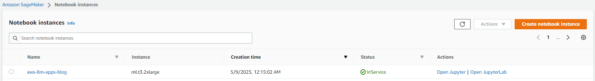
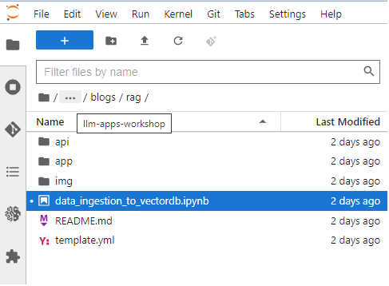
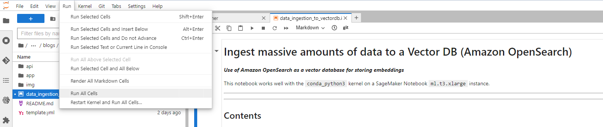
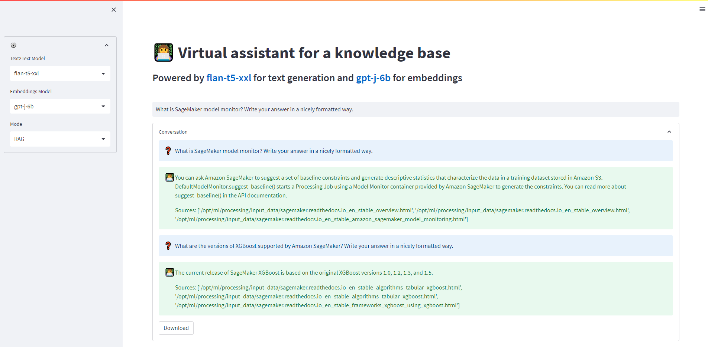
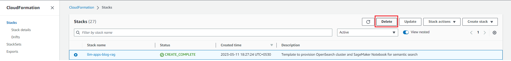

Building a Powerful Question Answering Bot with Amazon SageMaker, Amazon
OpenSearch, Streamlit, and LangChain: A Step-by-Step Guide
================

*Amit Arora*, *Xin Huang*, *Navneet Tuteja*

One of the most common applications of Generative AI (GenAI) and Large
Language Models (LLMs) in an enterprise environment is answering
questions based on the enterprise’s knowledge corpus. Pre-trained
foundation models (FMs) perform well at Natural Language Understanding
(NLU) tasks such summarization, text generation and question answering
on a broad variety of topics but either struggle to provide accurate
(without hallucinations) answers or completely fail at answering
questions about content that they have not seen as part of their
training data. Furthermore, FMs are trained with a point in time
snapshot of data and have no inherent ability to access fresh data at
inference time, without this ability they might provide responses that
are potentially incorrect or inadequate.

A commonly used approach to address the above mentioned problem is to
use a technique called Retrieval Augmented Generation (RAG). In the RAG
approach we convert the user question into vector embeddings using an
LLM and then do a similarity search for these embeddings in a
pre-populated vector database holding the embeddings for the enterprise
knowledge corpus. A small number of similar documents (typically three)
is added as context along with the user question to the “prompt”
provided to another LLM and then that LLM generates an answer to the
user question using information provided as context in the prompt. RAG
models were introduced by [Lewis et
al.](https://arxiv.org/abs/2005.11401) in 2020 as a model where
parametric memory is a pre-trained seq2seq model and the non-parametric
memory is a dense vector index of Wikipedia, accessed with a pre-trained
neural retriever.

In this blog post we provide a step-by-step guide with all the building
blocks for creating an enterprise ready RAG application such as a
question answering bot. We use a combination of different AWS services,
open-source foundation models ([FLAN-T5
XXL](https://huggingface.co/google/flan-t5-xxl) for text generation and
[GPT-j-6B](https://huggingface.co/EleutherAI/gpt-j-6b) for embeddings)
and packages such as
[LangChain](https://python.langchain.com/en/latest/index.html) for
interfacing with all the components and
[Streamlit](https://streamlit.io/) for building the bot frontend.

We provide a cloud formation template to stand up all the resources
required for building this solution and then demonstrate how to use
LangChain for tying everything together from interfacing with LLMs
hosted on SageMaker, to chunking of knowledge base documents and
ingesting document embeddings into OpenSearch and implementing the
question answer task,

We can use the same architecture to swap the open-source models with the
[Amazon Titan](https://aws.amazon.com/bedrock/titan/) models. After
[Amazon Bedrock](https://aws.amazon.com/bedrock/) launches, we will
publish a follow-up post showing how to implement similar GenAI
applications using Amazon Bedrock, so stay tuned.

## Solution overview

We use the [SageMaker docs](https://sagemaker.readthedocs.io) as the
knowledge corpus for this post. We convert the html pages on this site
into smaller overlapping chunks of information and then convert these
chunks into embeddings using the gpt-j-6b model and store the embeddings
into OpenSearch. We implement the RAG functionality inside an AWS Lambda
function with an Amazon API Gateway to handle routing all requests to
the Lambda. We implement a chatbot application in Streamlit which
invokes the Lambda via the API Gateway and the Lambda does a similarity
search for the user question with the embeddings in OpenSearch. The
matching documents (chunks) are added to the prompt as context by the
Lambda and then the Lambda use the flan-t5-xxl model deployed as a
SageMaker Endpoint to generate an answer to the user question. All code
for this post is available in the [GitHub
repo](https://github.com/aws-samples/llm-apps-workshop/tree/main/blogs/rag).

The following figure represents the high-level architecture of the
proposed solution.

<figure>

<figcaption aria-hidden="true">Figure 1: Architecture</figcaption>
</figure>

As illustrated in the architecture diagram, we use the following AWS
services:

- [Amazon SageMaker](https://aws.amazon.com/pm/sagemaker) and [Amazon
  SageMaker JumpStart](https://aws.amazon.com/sagemaker/jumpstart/) for
  hosting the two LLMs.
- [Amazon OpenSearch
  Service](https://aws.amazon.com/opensearch-service/) for storing the
  embeddings of the enterprise knowledge corpus and doing similarity
  search with user questions.
- [AWS Lambda](https://aws.amazon.com/lambda/) for implementing the RAG
  functionality and exposing it as a REST endpoint via the [Amazon API
  Gateway](https://aws.amazon.com/api-gateway/).
- [Amazon SageMaker Processing
  Jobs](https://docs.aws.amazon.com/sagemaker/latest/dg/processing-job.html)
  for large scale data ingestion into OpenSearch.
- [Amazon SageMaker Studio](https://aws.amazon.com/sagemaker/studio/)
  for hosting the Streamlit application.
- [AWS IAM](https://aws.amazon.com/iam/) roles and policies for access
  management.
- [AWS CloudFormation](https://aws.amazon.com/cloudformation/) for
  creating the entire solution stack through infrastructure as code.

In terms of open-source packages used in this solution, we use
[LangChain](https://python.langchain.com/en/latest/index.html) for
interfacing with OpenSearch and SageMaker, and
[FastAPI](https://github.com/tiangolo/fastapi) for implementing the REST
API interface in the Lambda.

The workflow for instantiating the solution presented in this blog in
your own AWS account is as follows:

1.  Run the AWS CloudFormation template provided with this blog in your
    account. This will create all the necessary infrastructure resources
    needed for this solution.

2.  Run the
    [`data_ingestion_to_vectordb.ipynb`](./data_ingestion_to_vectordb.ipynb)
    notebook in SageMaker Notebooks. This will ingest data from
    [SageMaker docs](https://sagemaker.readthedocs.io) into an
    OpenSearch index.

3.  Run the Streamlit application on a Terminal in SageMaker Studio and
    open the URL for the application in a new browser tab.

4.  Ask your questions about SageMaker via the chat interface provided
    by the Streamlit app and view the responses generated by the LLM.

These steps are discussed in detail in the sections below.

### Prerequisites

To implement the solution provided in this post, you should have an [AWS
account](https://signin.aws.amazon.com/signin?redirect_uri=https%3A%2F%2Fportal.aws.amazon.com%2Fbilling%2Fsignup%2Fresume&client_id=signup)
and familiarity with LLMs, OpenSearch and SageMaker.

#### Use AWS Cloud Formation to create the solution stack

We use AWS CloudFormation to create a SageMaker notebook called
`aws-llm-apps-blog` and an IAM role called `LLMAppsBlogIAMRole`. Choose
**Launch Stack** for the Region you want to deploy resources to. **This
template takes about 15 minutes to run completely**.

|        AWS Region         |                                                                                                                                 Link                                                                                                                                  |
|:-------------------------:|:---------------------------------------------------------------------------------------------------------------------------------------------------------------------------------------------------------------------------------------------------------------------:|
|  us-east-1 (N. Virginia)  |   [](https://console.aws.amazon.com/cloudformation/home?region=us-east-1#/stacks/new?stackName=llm-apps-blog-rag&templateURL=https://aws-blogs-artifacts-public.s3.amazonaws.com/artifacts/ML-14328/template.yml)    |
|     us-east-2 (Ohio)      |   [](https://console.aws.amazon.com/cloudformation/home?region=us-east-2#/stacks/new?stackName=llm-apps-blog-rag&templateURL=https://aws-blogs-artifacts-public.s3.amazonaws.com/artifacts/ML-14328/template.yml)    |
| us-west-1 (N. California) |   [](https://console.aws.amazon.com/cloudformation/home?region=us-west-1#/stacks/new?stackName=llm-apps-blog-rag&templateURL=https://aws-blogs-artifacts-public.s3.amazonaws.com/artifacts/ML-14328/template.yml)    |
|    eu-west-1 (Dublin)     |   [](https://console.aws.amazon.com/cloudformation/home?region=eu-west-1#/stacks/new?stackName=llm-apps-blog-rag&templateURL=https://aws-blogs-artifacts-public.s3.amazonaws.com/artifacts/ML-14328/template.yml)    |
|  ap-northeast-1 (Tokyo)   | [](https://console.aws.amazon.com/cloudformation/home?region=ap-northeast-1#/stacks/new?stackName=llm-apps-blog-rag&templateURL=https://aws-blogs-artifacts-public.s3.amazonaws.com/artifacts/ML-14328/template.yml) |

Once the cloud formation stack is created successfully click on the
`Outputs` tab of the stack and note the `OpenSearchDomainEndpoint` and
the `LLMAppAPIEndpoint`, we will be needing those in the subsequent
steps.

<figure>

<figcaption aria-hidden="true">Figure 2: Cloud Formation Stack
Outputs</figcaption>
</figure>

#### Ingest the data into OpenSearch

To ingest the data, complete the following steps:

1.  On the SageMaker console, choose **Notebooks** in the navigation
    pane.

2.  Select the notebook aws-llm-apps-blog and choose **Open
    JupyterLab**.

    <figure>
    
    <figcaption aria-hidden="true">Figure 3: Open JupyterLab</figcaption>
    </figure>

3.  Choose
    [`data_ingestion_to_vectordb.ipynb`](./data_ingestion_to_vectordb.ipynb)
    to open it in JupyterLab. This notebook will ingest the [SageMaker
    docs](https://sagemaker.readthedocs.io) to an OpenSearch index
    called `llm_apps_workshop_embeddings`.

    <figure>
    
    <figcaption aria-hidden="true">Figure 4: Open Data Inestion
    Notebook</figcaption>
    </figure>

4.  Once the notebook is open, then, on the Run menu, choose **Run All
    Cells** to run the code in this notebook. This will download the
    dataset locally into the notebook and then ingest it into the
    OpenSearch index. This notebook takes about 20 minutes to run. The
    notebook also ingests the data into another vector database called
    [`FAISS`](https://github.com/facebookresearch/faiss) for
    illustration purposes, the FAISS index files are saved locally and
    the uploaded to S3 so that they can optionally be used by the Lambda
    function as an illustration of using an alternate vector database.

    <figure>
    
    <figcaption aria-hidden="true">Figure 5: Notebook Run All
    Cells</figcaption>
    </figure>

    We use LangChain’s `RecursiveCharacterTextSplitter` class to split
    the documents into chunks and these documents, these chunks are then
    converted into embeddings using LangChain
    `SagemakerEndpointEmbeddingsJumpStart` class via the gpt-j-6b LLM.
    These embeddings are then stored into OpenSearch, again using
    LangChain, via the `OpenSearchVectorSearch` class. We package this
    code into Python scripts that are provided to the SageMaker
    Processing Job via a custom container. See the
    [`data_ingestion_to_vectordb.ipynb`](./data_ingestion_to_vectordb.ipynb)
    notebook for the full code.

    - We create a custom container in which we will install the
      `langchain` and `opensearch-py` Python packages and then upload
      this container image to Amazon Elastic Container Registry (ECR).
    - We use the SageMaker `ScriptProcessor` class to create a SageMaker
      Processing job that will run on multiple nodes.
      - The data files available in S3 are automatically distributed
        across in the SageMaker Processing Job instances by setting
        `s3_data_distribution_type='ShardedByS3Key'` as part of the
        `ProcessingInput` provided to the processing job.
      - Each node processes a subset of the files and this brings down
        the overall time required to ingest the data into OpenSearch.
      - Each node also uses Python `multiprocessing` to internally also
        parallelize the file processing. Thus, **there are two levels of
        parallelization happening, one at the cluster level where
        individual nodes are distributing the work (files) amongst
        themselves and another at the node level where the files in a
        node are also split between multiple processes running on the
        node**.

    ``` python
    # setup the ScriptProcessor with the above parameters
    processor = ScriptProcessor(base_job_name=base_job_name,
                                image_uri=image_uri,
                                role=aws_role,
                                instance_type=instance_type,
                                instance_count=instance_count,
                                command=["python3"],
                                tags=tags)

    # setup input from S3, note the ShardedByS3Key, this ensures that 
    # each instance gets a random and equal subset of the files in S3.
    inputs = [ProcessingInput(source=f"s3://{bucket}/{app_name}/{DOMAIN}",
                              destination='/opt/ml/processing/input_data',
                              s3_data_distribution_type='ShardedByS3Key',
                              s3_data_type='S3Prefix')]


    logger.info(f"creating an opensearch index with name={opensearch_index}")
    # ready to run the processing job
    st = time.time()
    processor.run(code="container/load_data_into_opensearch.py",
                  inputs=inputs,
                  outputs=[],
                  arguments=["--opensearch-cluster-domain", opensearch_domain_endpoint,
                            "--opensearch-secretid", os_creds_secretid_in_secrets_manager,
                            "--opensearch-index-name", opensearch_index,
                            "--aws-region", aws_region,
                            "--embeddings-model-endpoint-name", embeddings_model_endpoint_name,
                            "--chunk-size-for-doc-split", str(CHUNK_SIZE_FOR_DOC_SPLIT),
                            "--chunk-overlap-for-doc-split", str(CHUNK_OVERLAP_FOR_DOC_SPLIT),
                            "--input-data-dir", "/opt/ml/processing/input_data",
                            "--create-index-hint-file", CREATE_OS_INDEX_HINT_FILE,
                            "--process-count", "2"])
    ```

5.  Close the notebook after all cells run without any error. Your data
    is now available in OpenSearch. The following screenshot shows the
    count of documents in the `llm_apps_workshop_embeddings` index
    created in OpenSearch. Type the following URL in your browser’s
    address bar to get a count of documents in the
    `llm_apps_workshop_embeddings` index. Use the OpenSearch domain
    endpoint from the cloud formation stack outputs in the URL below.

        https://your-opensearch-domina-endpoint/llm_apps_workshop_embeddings/_count

    The browser window should show an output similar to the one below.
    This output shows that 5,667 documents were ingested into the
    `llm_apps_workshop_embeddings` index.
    `{"count":5667,"_shards":{"total":5,"successful":5,"skipped":0,"failed":0}}`

### Run the Streamlit application in SageMaker Studio

We are now ready to run the Streamlit web application for our question
answering bot. This application allows the user to ask a question and
then fetches the answer via the `/llm/rag` REST API endpoint provided by
the Lambda function.

SagMaker Studio provides a convenient platform to host the Streamlit web
application. The following steps describes how to run the Streamlit app
on SageMaker Studio. Alternatively, you could also follow the same
procedure to run the app on your laptop.

1.  Open SageMaker Studio and then open a new Terminal.

2.  Run the following commands on the Terminal. These commands clone the
    code repository for this blog and install the Python packages needed
    by the application.

    ``` bash
    git clone https://github.com/aws-samples/llm-apps-workshop
    cd llm-apps-workshop/blogs/rag/app
    pip install -r requirements.txt
    ```

3.  The API Gateway endpoint URL that is available from the cloud
    formation stack output needs to be set in the `webapp.py` file. This
    is done by running the `sed` command shown below. **Replace the Run
    the `LLMAppAPIEndpoint-value-from-cloudformation-stack-outputs` with
    the value of the `LLMAppAPIEndpoint` field from the cloud formation
    stack output** and then run the following commands to start a
    Streamlit app on SageMaker Studio.

    ``` bash
    # replace __API_GW_ENDPOINT__ with  output from the cloud formation stack
    EP=LLMAppAPIEndpoint-value-from-cloudformation-stack-outputs
    sed -i "s|__API_GW_ENDPOINT__|$EP|g" webapp.py
    streamlit run webapp.py    
    ```

4.  When the application runs successfully, you would see an output
    similar to the following (the IP addresses you will see would be
    different from the ones shown below). Note the port number
    (typically 8501) from the output below.

    ``` bash
    sagemaker-user@studio$ streamlit run webapp.py 

    Collecting usage statistics. To deactivate, set browser.gatherUsageStats to False.


      You can now view your Streamlit app in your browser.

      Network URL: http://169.255.255.2:8501
      External URL: http://52.4.240.77:8501
    ```

5.  You can access the app by opening the following URL in a new browser
    tab
    `https://replace-with-your-studio-domain.studio.replace-with-your-region.sagemaker.aws/jupyter/default/proxy/8501/app`
    (if you noted a port number different from 8501 in the previous step
    then replace 8501 with that port number). Here is a screenshot of
    the app with a couple of user questions.
    

### A closer look at the RAG implementation in the Lambda function

Now that we have the application working end-to-end, lets take a closer
look at the Lambda function. The Lambda function uses
[`FastAPI`](https://fastapi.tiangolo.com/lo/) to implement the REST API
for RAG and the [`Mangum`](https://pypi.org/project/mangum/) package to
wrap the API with a handler that we will package and deploy in the AWS
Lambda. We use the AWS API Gateway to route all incoming requests to
invoke the lambda and handle the routing internally within our
application.

The following code snippet shows how we find documents in the OpenSearch
index that are similar to the user question and then create a prompt by
combining the question and the similar documents. This prompt is then
provided to the LLM for generating an answer to the user question.

``` python

@router.post("/rag")
async def rag_handler(req: Request) -> Dict[str, Any]:
    # dump the received request for debugging purposes
    logger.info(f"req={req}")

    # initialize vector db and SageMaker Endpoint
    _init(req)

    # Use the vector db to find similar documents to the query
    # the vector db call would automatically convert the query text
    # into embeddings
    docs = _vector_db.similarity_search(req.q, k=req.max_matching_docs)
    logger.info(f"here are the {req.max_matching_docs} closest matching docs to the query=\"{req.q}\"")
    for d in docs:
        logger.info(f"---------")
        logger.info(d)
        logger.info(f"---------")

    # now that we have the matching docs, lets pack them as a context
    # into the prompt and ask the LLM to generate a response
    prompt_template = """Answer based on context:\n\n{context}\n\n{question}"""

    prompt = PromptTemplate(
        template=prompt_template, input_variables=["context", "question"]
    )
    logger.info(f"prompt sent to llm = \"{prompt}\"")
    chain = load_qa_chain(llm=_sm_llm, prompt=prompt)
    answer = chain({"input_documents": docs, "question": req.q}, return_only_outputs=True)['output_text']
    logger.info(f"answer received from llm,\nquestion: \"{req.q}\"\nanswer: \"{answer}\"")
    resp = {'question': req.q, 'answer': answer}
    if req.verbose is True:
        resp['docs'] = docs

    return resp
```

## Clean up

To avoid incurring future charges, delete the resources. You can do this
by deleting the CloudFormation stack as shown in the screenshot below.

<figure>

<figcaption aria-hidden="true">Figure 6: Cleaning Up</figcaption>
</figure>

## Conclusion

In this post, we showed how to create an enterprise ready RAG solution
using a combination of AWS service, open-source LLMs and open-source
Python packages.

We encourage you to learn more by exploring [Amazon SageMaker
JumpStart](https://aws.amazon.com/sagemaker/jumpstart/), [Amazon
Titan](https://aws.amazon.com/bedrock/titan/) models, [Amazon
Bedrock](https://aws.amazon.com/bedrock/) service and [Amazon OpenSearch
Service](https://aws.amazon.com/opensearch-service/) and building a
solution using the sample implementation provided in this post and a
dataset relevant to your business. If you have questions or suggestions,
leave a comment.

------------------------------------------------------------------------

## Author bio

Amit
Arora is an AI and ML specialist architect at Amazon Web Services,
helping enterprise customers use cloud-based machine learning services
to rapidly scale their innovations. He is also an adjunct lecturer in
the MS data science and analytics program at Georgetown University in
Washington D.C.

<br><br>

Dr. Xin
Huang is a Senior Applied Scientist for Amazon SageMaker JumpStart and
Amazon SageMaker built-in algorithms. He focuses on developing scalable
machine learning algorithms. His research interests are in the area of
natural language processing, explainable deep learning on tabular data,
and robust analysis of non-parametric space-time clustering. He has
published many papers in ACL, ICDM, KDD conferences, and Royal
Statistical Society: Series A.

<br><br>

Navneet
Tuteja is a Data Specialist at Amazon Web Services. Before joining AWS,
Navneet worked as a facilitator for organizations seeking to modernize
their data architectures and implement comprehensive AI/ML solutions.
She holds an engineering degree from Thapar University, as well as a
master’s degree in statistics from Texas A&M University.
